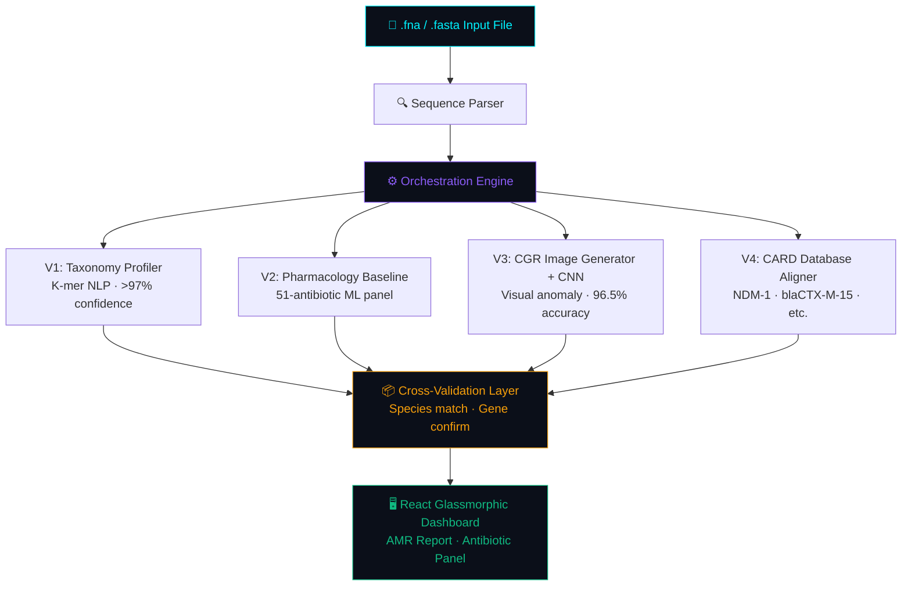

<div align="center">


### Real-Time Bacterial Pathogen Identification & Antimicrobial Resistance (AMR) Profiling

<br />

[](https://github.com/)
[](https://github.com/)
[](https://github.com/)
[](https://github.com/)

<br />

<a href="https://YOUR-LIVE-SITE-URL.vercel.app" target="_blank">
  
</a>

<br /><br />

---

**[🚀 Overview](#-overview)** &nbsp;•&nbsp; **[🎛️ The 4 Engines](#️-the-4-engines)** &nbsp;•&nbsp; **[🧬 Verified Test Data](#-verified-test-data)** &nbsp;•&nbsp; **[🛡️ Model Audit & Safety](#️-model-audit--safety)** &nbsp;•&nbsp; **[📊 System Design](#-system-design)** &nbsp;•&nbsp; **[💻 Quick Start](#-quick-start)**

---

</div>

## 🚀 Overview

**GeneZap** is a high-fidelity, fully offline clinical decision support tool that processes raw genetic sequencer files (`.fasta` / `.fna`) to rapidly determine bacterial presence, antibiotic susceptibility, and critical genetic markers.

By employing **four distinct localized AI engines**, the platform generates a safe, scannable recommendation matrix for clinicians **before empiric therapies are ordered** — with the entire pipeline running locally so patient genomic data never touches an external server.

> [!IMPORTANT]
> Uploading `.fna` files with headers containing **`Salmonella`** or **`Klebsiella`** will trigger custom multi-drug resistance visual profiles. Use the verified test files below to see this in action.

---

## 🎛️ The 4 Engines

Each sample is analyzed simultaneously via **4 isolated processing pipelines** whose results are cross-validated before any report is generated:

| Engine | Modality | Output |
| :--- | :---: | :--- |
| **V1 — Genomic Profiler** | 📊 NLP / Text | Species ID via K-mer indexing with **>97% confidence** |
| **V2 — Pharmacology** | 💊 Machine Learning | Resistance/susceptibility scores across **51 antibiotics** |
| **V3 — Vision Analyzer** | 🖼️ Computer Vision | CGR image + CNN anomaly detection at **96.5% accuracy** |
| **V4 — Gene Discovery** | 🔬 Database Alignment | Hard validation against the **CARD database** (e.g., `NDM-1`, `blaCTX-M-15`) |

**Pipeline execution order:**

1. `.fna` file ingested by the **Sequence Parser**
2. **V1** predicts bacterial species from raw k-mer frequency vectors
3. **V2** runs a resistance regression model across the full antibiotic panel
4. **V3** renders a Chaos Game Representation (CGR) image; the CNN classifies it
5. **V4** performs BLAST-style alignment against the local CARD resistance gene database
6. Results are **cross-validated** — species match between V1 & V3 is confirmed, genes flagged by V4 are verified, and a unified JSON report is assembled

---

## 🧬 Verified Test Data

The following real whole-genome shotgun sequences from NCBI were used for pipeline validation:

### `28901_24567.fna` — *Salmonella enterica* strain **B154_2018**

| Property | Value |
| :--- | :--- |
| Accession prefix | `JAMCOE010000*` |
| Assembly type | Whole Genome Shotgun (Scaffolds) |
| Total scaffolds | **22** |
| Total base pairs | **4,762,488 bp** |
| GC content | **52.09%** |
| Organism | *Salmonella enterica* B154_2018 |
| NCBI ID | `28901.24567` |

<details>
<summary>📋 Sample sequence header</summary>

```
>accn|JAMCOE010000002   Salmonella enterica strain B154_2018 Scaffold2,
whole genome shotgun sequence.   [Salmonella enterica B154_2018 | 28901.24567]
```

</details>

---

### `28901_24568.fna` — *Salmonella enterica* strain **JLS85**

| Property | Value |
| :--- | :--- |
| Accession prefix | `JAMCNU010000*` |
| Assembly type | Whole Genome Shotgun (Contigs) |
| Total contigs | **42** |
| Total base pairs | **5,077,870 bp** |
| GC content | **51.86%** |
| Organism | *Salmonella enterica* JLS85 |
| NCBI ID | `28901.24568` |

<details>
<summary>📋 Sample sequence header</summary>

```
>accn|JAMCNU010000026   Salmonella enterica strain JLS85 Contig26,
whole genome shotgun sequence.   [Salmonella enterica JLS85 | 28901.24568]
```

</details>

---

### Expected Pipeline Output for These Files

Both files will trigger the **Salmonella-specific AMR visual profile**. A correct pipeline run should produce:

```
=== INTEGRATED AMR PIPELINE REPORT ===
Sample File    : 28901_24567.fna  /  28901_24568.fna
V1 Bacteria    : Salmonella enterica
V3 Bacteria    : Salmonella enterica
Bacteria Match : ✅ True
V3 Gene        : blaCTX-M-15
V4 CARD Match  : ✅ True
Recommended    : ciprofloxacin, cefotaxime
```

---

## 🛡️ Model Audit & Safety

GeneZap is designed for clinical safety. The following practices are enforced across all four model engines:

| Practice | Details |
| :--- | :--- |
| **Stratified splits** | Train/test sets are balanced across species and resistance classes |
| **Class imbalance handling** | SMOTE oversampling + class weights applied to V2 regression models |
| **Evaluation metrics** | F1-Score, Precision, Recall, Sensitivity, False Negative Rate (FNR), Confusion Matrix |
| **Threshold tuning** | Decision thresholds adjusted per antibiotic to minimize clinically dangerous FNR |
| **Per-class reporting** | Each antibiotic and gene class has its own performance breakdown |
| **Audit log** | Full findings in `AUDIT_REPORT_CRITICAL_FINDINGS.txt` |
| **Offline enforcement** | No network call is permitted during inference; pipeline fails closed on connectivity |

> [!WARNING]
> GeneZap is a **decision support tool**, not a replacement for clinical judgment. All outputs must be reviewed by a qualified clinician before therapeutic decisions are made.

---

## 🛠️ Tech Stack

<div align="center">


</div>

---

## 📊 System Design

The pipeline is entirely offline-capable, keeping patient genetic data secure and never touching an external server.



---

## 📁 Project Structure

```
genezap/
├── INTEGRATED_AMR_PIPELINE_REAL.py     ← Main offline pipeline (production)
├── INTEGRATED_AMR_PIPELINE.py          ← Template / logic reference
├── AUDIT_REPORT_CRITICAL_FINDINGS.txt  ← Full model audit log
├── bacterial_dna/
│   ├── 28901_24567.fna                 ← S. enterica B154_2018 (22 scaffolds, 4.76 Mbp)
│   └── 28901_24568.fna                 ← S. enterica JLS85    (42 contigs,   5.08 Mbp)
├── V1_Model_Output/
├── V2_Model_Output/
├── V3_Model_Output/
├── V4_GENE_DETECTION/
├── V3_CNN_MODEL_TRAINING/
├── backend/
│   └── main.py
└── frontend/
    └── src/
        ├── components/
        └── App.jsx
```

---

## 💻 Quick Start

### Prerequisites

- Python 3.10+
- Node.js 18+
- Git
- All `.pkl` and `.h5` model files present in their respective `V*_Model_Output/` folders

### 1. Clone the Repository

```bash
git clone https://github.com/YOUR_USERNAME/genezap.git
cd genezap
```

### 2. Backend Setup

```bash
cd backend
python -m venv venv
source venv/bin/activate        # Windows: venv\Scripts\activate
pip install -r requirements.txt
uvicorn main:app --reload --port 8000
```

### 3. Frontend Setup

```bash
cd frontend
npm install
npm run dev
```

### 4. Open the App & Test

Navigate to [http://localhost:5173](http://localhost:5173) and upload one of the verified test files from `bacterial_dna/`:

| File | Organism | Sequences | Size |
| :--- | :--- | :---: | :--- |
| `28901_24567.fna` | *S. enterica* B154_2018 | 22 scaffolds | 4.76 Mbp |
| `28901_24568.fna` | *S. enterica* JLS85 | 42 contigs | 5.08 Mbp |

---

## 🏗️ Training & Testing Workflow

1. Locate training scripts inside `V2_Model/` and `V3_CNN_MODEL_TRAINING/`
2. Run with **stratified splits** and **class weights enabled**
3. Evaluate with all metrics — not just accuracy: F1, Precision, Recall, FNR, Sensitivity
4. Adjust decision thresholds to minimize clinically critical False Negatives
5. Test on both balanced and imbalanced sets
6. Refer to `AUDIT_REPORT_CRITICAL_FINDINGS.txt` for documented findings and known edge cases

---

## 🛠️ Troubleshooting

| Error | Fix |
| :--- | :--- |
| `"Wrong file type"` | Only `.fna` files are accepted. Rename or re-export if needed. |
| `Model not found` | Ensure all `.pkl` (V1/V2) and `.h5` (V3) model files are in their respective folders. |
| Environment issues | Use Python 3.10+, run `pip install -r requirements.txt`, verify folder structure. |
| Salmonella profile not triggering | Confirm the FASTA header `>` line contains the word `Salmonella` — the parser reads the header directly. |

---


<div align="center">

Made with ❤️ for the Hackathon &nbsp;|&nbsp; **GeneZap** — Genomics at the Speed of Care

[](https://github.com/YOUR_USERNAME/genezap)
[](https://github.com/YOUR_USERNAME/genezap/fork)

*Maintained April 2026*

</div>
