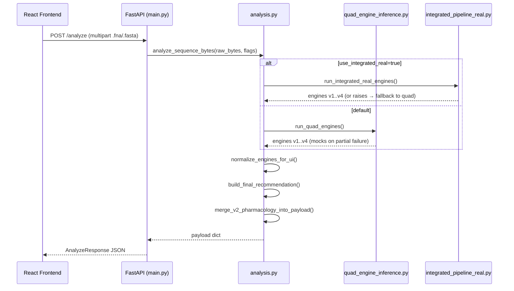
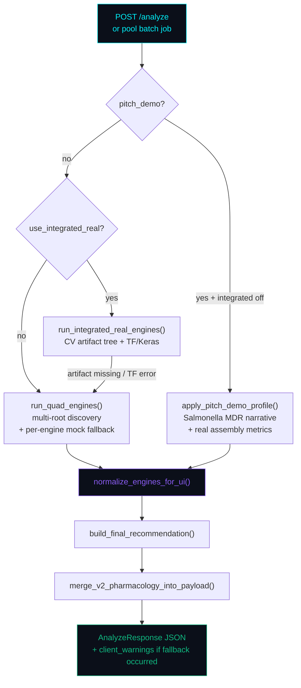
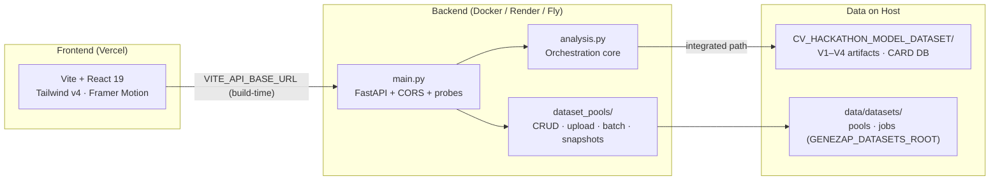
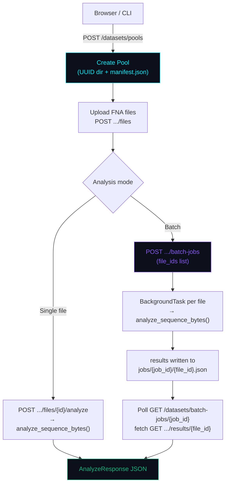
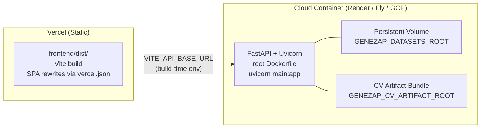

<div align="center">


<h3>Quad-Engine AMR Inference &nbsp;·&nbsp; Dataset Pools &nbsp;·&nbsp; FastAPI + React</h3>

<br/>

[](https://www.python.org/)
[](https://fastapi.tiangolo.com/)
[](https://react.dev/)
[](https://vitejs.dev/)
[](https://www.tensorflow.org/)
[](https://www.docker.com/)
[](https://vercel.com/)
[](./LICENSE)

<br/>

[](https://YOUR-LIVE-SITE-URL.vercel.app)

<br/>

---

[Overview](#overview) &nbsp;·&nbsp; [Architecture](#architecture) &nbsp;·&nbsp; [Engines](#inference-engines) &nbsp;·&nbsp; [Dataset Pools](#dataset-pool-system) &nbsp;·&nbsp; [API](#api-reference) &nbsp;·&nbsp; [Quick Start](#quick-start) &nbsp;·&nbsp; [Deploy](#deployment) &nbsp;·&nbsp; [Roadmap](#roadmap)

---

</div>

<a name="overview"></a>
## Overview

**GeneZap** is a full-stack AI systems platform for **antimicrobial resistance (AMR) analysis from bacterial DNA assemblies**. It orchestrates four complementary inference engines — taxonomy profiling, pharmacology modelling, visual CGR/CNN analysis, and CARD gene discovery — into a single clinical-grade JSON contract consumed by a React dashboard.

The platform is architected as a **research and hackathon-grade** workspace: practical for lab demos and portfolio showcase, but structured with the upgrade paths and separation of concerns expected in production AI systems.

> [!IMPORTANT]
> **This is a demonstration and research platform, not a regulated medical device.** All outputs require laboratory confirmation and qualified clinical judgment before any therapeutic decision.

### What makes this architecturally interesting

| Design decision | Rationale |
| :--- | :--- |
| **Dual inference backends** | A resilient quad-engine default path (with per-engine mock fallbacks) plus a frozen-artifact integrated path — independently selectable per request, never silently mixed. |
| **Single orchestration contract** | `analyze_sequence_bytes()` in `analysis.py` normalises both backends to one JSON shape, so the UI and dataset pool batch runner share the same contract regardless of which engines ran. |
| **Filesystem-first dataset pools** | UUID-keyed pool directories with JSON manifests and a clean env-indirection hook (`GENEZAP_DATASETS_ROOT`) make a future migration to object storage + Postgres a config change, not a rewrite. |
| **Deployment-split architecture** | Vite static frontend (Vercel-deployable in one command) + containerised FastAPI backend (root `Dockerfile`) with env-driven CORS, size limits, and readiness probes — cleanly separable. |

---

<a name="architecture"></a>
## Architecture

### Request lifecycle — single FASTA upload



### Orchestration layer — decision tree



### Repository layout



### Engine modes at a glance

| Mode | Trigger | Failure behaviour |
| :--- | :--- | :--- |
| **Quad-engine** | Default (`use_integrated_real=false`) | Per-engine mock substitution — API never hard-fails |
| **Integrated (CV artifacts)** | `use_integrated_real=true` | Raises on missing artifacts/TF → caught by `analysis.py` → falls back to quad + surfaces `client_warnings` |
| **Pitch demo** | `pitch_demo=true` + integrated off | Replaces engine JSON with fixed Salmonella MDR narrative; real assembly metrics preserved |

> [!NOTE]
> `pitch_demo` and `use_integrated_real` are **mutually exclusive**. The API enforces this and the React UI disables the controls accordingly.

---

<a name="inference-engines"></a>
## Inference Engines

Four complementary signal channels run in parallel, each targeting a different modality of the resistance signal:

| Engine | Modality | Quad path | Integrated path |
| :--- | :---: | :--- | :--- |
| **V1 — Genomic Profiler** | 📊 NLP / K-mer | Multi-root artifact discovery; mock on failure | `bacterial_id_model.pkl` + label encoder from CV tree |
| **V2 — Pharmacology** | 💊 ML regression | Drug-panel heuristics + artifact loop; mock on failure | `v2_feature_columns_FIXED.pkl` + multiclass model |
| **V3 — Vision (CGR + CNN)** | 🖼️ Computer Vision | CGR render + Keras inference or fallback image | `v3_vision_model.h5`; requires TensorFlow |
| **V4 — Gene Discovery** | 🔬 CARD alignment | Local FASTA alignment via `V4_GENE_DETECTION/` | `CARD_DB.fasta` + gene-detection helpers |

**Why four engines instead of one?** AMR is genuinely multi-modal. K-mer taxonomy (V1), drug-panel regression (V2), sequence-derived imagery (V3), and curated gene databases (V4) each capture orthogonal signal. Cross-validating them surfaces conflicts, builds confidence intervals, and avoids the silent overconfidence of a single black-box model.

<details>
<summary><strong>Verified test genomes (real NCBI assemblies)</strong></summary>

Both files are whole-genome shotgun assemblies of *Salmonella enterica* sourced from NCBI and used to validate the pipeline end-to-end:

| File | Strain | Type | Sequences | Base pairs | GC% |
| :--- | :--- | :--- | :---: | :--- | :--- |
| `28901_24567.fna` | *S. enterica* B154_2018 | Scaffolds | 22 | 4,762,488 bp | 52.09% |
| `28901_24568.fna` | *S. enterica* JLS85 | Contigs | 42 | 5,077,870 bp | 51.86% |

Expected pipeline output for both files:

```
=== INTEGRATED AMR PIPELINE REPORT ===
Sample File    : 28901_24567.fna  /  28901_24568.fna
V1 Bacteria    : Salmonella enterica
V3 Bacteria    : Salmonella enterica
Bacteria Match : True
V3 Gene        : blaCTX-M-15
V4 CARD Match  : True
Recommended    : ciprofloxacin, cefotaxime
```

</details>

---

<a name="dataset-pool-system"></a>
## Dataset Pool System

The pool system is one of the platform's most architecturally deliberate components. Rather than treating FASTA uploads as stateless one-shots, GeneZap manages **named, versioned genome collections** with batch analysis and manifest snapshots.



**Key design decisions:**

- **UUID-keyed pool directories** under `pools/<pool_id>/` with a `pool_manifest.json` and a `files/` subdirectory — inspectable without a running service.
- **Manifest snapshots** (`POST .../snapshot`) bump `manifest_version` and write `snapshots/vN.json` for point-in-time recovery.
- **Server path import** available in dev (`GENEZAP_ALLOW_DATASET_PATH_IMPORT=1`) and blocked in production — a deliberate security gate.
- **Batch jobs** use FastAPI `BackgroundTasks` — sufficient for hackathon and research workloads; see [Limitations](#limitations) for honest caveats on durability.
- **Env-indirection** (`GENEZAP_DATASETS_ROOT`) means the storage backend can move to S3/R2 without rewriting the API contract. See [Roadmap](#roadmap).

---

## Tech Stack

<div align="center">

| Layer | Technologies |
| :--- | :--- |
| **Frontend** | React 19, Vite 8, Tailwind CSS v4, Framer Motion, Lucide icons |
| **Backend** | Python 3.11+, FastAPI, Uvicorn, Pydantic v2, Starlette middleware |
| **ML / Inference** | TensorFlow / Keras (V3), scikit-learn via `joblib` (V1/V2), NumPy, Pandas, Matplotlib, Pillow |
| **Reference data** | CARD-derived FASTA + gene-detection helpers (`CV_HACKATHON_MODEL_DATASET/`, `V4_GENE_DETECTION/`) |
| **Storage (current)** | Filesystem: `data/datasets/` pools + jobs; model bundle path via `GENEZAP_CV_ARTIFACT_ROOT` |
| **Deployment** | Docker (repo root Dockerfile), Vercel (static frontend), Render / Fly.io (backend) |

</div>

---

## Project Structure

```
BV-BRC_Dataset/
├── Dockerfile                          # API image: backend + CV artifact bundle + uvicorn
├── .dockerignore
├── docs/
│   ├── DEPLOYMENT.md                   # Full env matrix: Vercel + Render/Fly + Docker
│   └── DATASET_POOLS.md                # Pool API semantics, manifests, import rules
├── data/datasets/                      # Default GENEZAP_DATASETS_ROOT (gitignored contents)
│
├── frontend/
│   ├── src/
│   │   ├── App.jsx                     # Clinical UI: single upload + dataset pool tabs
│   │   ├── config.js                   # VITE_API_BASE_URL → API_BASE
│   │   ├── services/datasetsApi.js     # Pool/batch API client
│   │   └── components/dataset/         # DatasetPoolPanel + supporting components
│   ├── vercel.json                     # SPA rewrites for Vercel
│   ├── vite.config.js
│   └── package.json
│
├── backend/
│   ├── main.py                         # FastAPI app, CORS, /analyze, /health, /ready
│   ├── analysis.py                     # Core orchestration: parse → engines → payload
│   ├── quad_engine_inference.py        # Default multi-root engine runner + mock fallbacks
│   ├── integrated_pipeline_real.py     # CV artifact pipeline (TF/Keras path)
│   ├── genezap_settings.py             # Central deployment env + limits
│   ├── dataset_pools/                  # Router, repository, batch jobs, validation
│   ├── middleware/max_body.py
│   ├── env.example
│   └── requirements.txt
│
└── CV_HACKATHON_MODEL_DATASET/
    ├── V1_Model_Output/                # Species ID pickles
    ├── V2_Model_Output/                # Drug-panel pickles
    ├── V3_Model_Output/                # Keras vision model (.h5)
    ├── V4_GENE_DETECTION/              # CARD alignment helpers
    ├── MAIN_MODEL/CARD_DB.fasta
    └── INTEGRATED_AMR_PIPELINE_REAL.py # CLI reference (API uses integrated_pipeline_real.py)
```

---

<a name="quick-start"></a>
## Quick Start

### Prerequisites

- **Python 3.11+** — recommended for TensorFlow wheel compatibility
- **Node.js 20+** — required for Vite 8
- **Git LFS** (or manual placement) for large model files (`*.pkl`, `*.h5`) excluded by `.gitignore`

### 1 — Clone

```bash
git clone https://github.com/YOUR_USERNAME/genezap.git
cd genezap
```

### 2 — Backend

```bash
cd backend
python -m venv .venv
source .venv/bin/activate          # Windows: .venv\Scripts\activate
pip install -r requirements.txt

# Optional: copy and configure environment
cp env.example .env

uvicorn main:app --reload --port 8000
```

| Endpoint | Purpose |
| :--- | :--- |
| `GET /health` | Process alive |
| `GET /health/live` | Liveness probe |
| `GET /ready` | Writable `GENEZAP_DATASETS_ROOT` (503 if not) |

### 3 — Frontend

```bash
cd frontend
# Optional: set API origin for local dev
echo "VITE_API_BASE_URL=http://127.0.0.1:8000" > .env.local
npm install
npm run dev
# Dev server: http://localhost:5173
```

### 4 — Docker (backend + CV bundle)

```bash
# Build from repository root
docker build -t genezap-api .

# Run with CORS for local frontend
docker run --rm -p 8000:8000 \
  -e GENEZAP_CORS_ORIGINS=http://localhost:5173 \
  genezap-api

# With persistent pool storage
docker run --rm -p 8000:8000 \
  -v genezap-data:/data/datasets \
  -e GENEZAP_DATASETS_ROOT=/data/datasets \
  -e GENEZAP_CORS_ORIGINS=http://localhost:5173 \
  genezap-api
```

---

<a name="api-reference"></a>
## API Reference

Base URL: your deployed API (e.g. `https://api.example.com`) or `http://127.0.0.1:8000` locally.

### `POST /analyze`

Multipart form upload. Field name: **`file`**. Accepted: `.fna`, `.fasta`, `.fa`.

| Query param | Default | Description |
| :--- | :---: | :--- |
| `use_integrated_real` | `false` | Use frozen CV artifact pipeline (V1–V4 via TF/Keras + joblib). Mutually exclusive with `pitch_demo`. |
| `pitch_demo` | `false` | Substitute engine JSON with a Salmonella MDR demo narrative while preserving real assembly metrics. |

```bash
# Standard quad-engine analysis
curl -sS -X POST "http://127.0.0.1:8000/analyze" \
  -F "file=@28901_24567.fna" | jq .final_recommendation

# Integrated artifact path
curl -sS -X POST "http://127.0.0.1:8000/analyze?use_integrated_real=true" \
  -F "file=@28901_24567.fna"
```

**Response highlights:** `diagnostic_report.engines` (v1–v4), `final_recommendation`, optional `susceptibility_profile`, optional `diagnostic_report.client_warnings` (integrated fallback or pitch suppression notice).

### Dataset Pools (`/datasets`)

<details>
<summary>Expand pool & batch API endpoints</summary>

| Method + Route | Description |
| :--- | :--- |
| `POST /datasets/pools` | Create a named pool |
| `GET /datasets/pools` | List all pools |
| `GET /datasets/pools/{pool_id}` | Pool detail + file manifest |
| `POST /datasets/pools/{pool_id}/files` | Upload one or more FASTA files (repeat `files` field) |
| `POST /datasets/pools/{pool_id}/files/{file_id}/analyze` | Run inference on a single pooled file |
| `POST /datasets/pools/{pool_id}/batch-jobs` | Async batch: `{"file_ids": [...]}` |
| `GET /datasets/batch-jobs/{job_id}` | Poll batch status |
| `GET /datasets/batch-jobs/{job_id}/results/{file_id}` | Fetch one batch result JSON |
| `POST /datasets/pools/{pool_id}/snapshot` | Bump manifest version + write snapshot |
| `GET /datasets/config/hints` | Operator-facing limits (non-secret) |

**Example: create pool → upload → batch analyse**

```bash
# Create pool
POOL=$(curl -sS -X POST http://127.0.0.1:8000/datasets/pools \
  -H "Content-Type: application/json" \
  -d '{"name":"lab-batch-01","description":"BV-BRC validation set"}' \
  | jq -r .pool_id)

# Upload files
curl -sS -X POST "http://127.0.0.1:8000/datasets/pools/$POOL/files" \
  -F "files=@28901_24567.fna" \
  -F "files=@28901_24568.fna"

# Submit batch job
JOB=$(curl -sS -X POST "http://127.0.0.1:8000/datasets/pools/$POOL/batch-jobs" \
  -H "Content-Type: application/json" \
  -d '{"file_ids":["FILE_ID_1","FILE_ID_2"]}' | jq -r .job_id)

# Poll until complete
curl "http://127.0.0.1:8000/datasets/batch-jobs/$JOB"
```

</details>

---

<a name="deployment"></a>
## Deployment

Full environment matrix: **`docs/DEPLOYMENT.md`**.



| Target | Key steps |
| :--- | :--- |
| **Frontend → Vercel** | Project root: `frontend/`. Set `VITE_API_BASE_URL` to your HTTPS API URL. `vercel.json` SPA rewrite is already included. |
| **Backend → Render / Fly** | Build from repo root `Dockerfile`. Set `GENEZAP_ENV`, `GENEZAP_CORS_ORIGINS`, `GENEZAP_DATASETS_ROOT`, and optionally `GENEZAP_CV_ARTIFACT_ROOT`. |

---

<a name="limitations"></a>
## Limitations

Honest constraints are part of engineering maturity.

| Constraint | Detail |
| :--- | :--- |
| **Not a medical device** | Demo, research, and portfolio use only. Outputs require clinical confirmation. |
| **Quad-engine mocks** | Missing artifacts yield **simulated** engine JSON. Always check the `mode` field in payloads before interpreting results. |
| **Batch job durability** | `BackgroundTasks` runs in-process — not durable across replicas or restarts. A job lost on crash is lost. See [Roadmap](#roadmap) for the queue path. |
| **Free-tier cold starts** | TensorFlow import adds several seconds on first request after sleep; factor this into demo timing. |
| **Ephemeral storage** | Without a mounted volume, pool data is lost on container restart on Render/Fly free tiers. |
| **pitch\_demo vs integrated** | These modes are mutually exclusive. Enabling both is a user error; the API enforces this explicitly via `client_warnings`. |
| **Memory / wall-clock** | V2 pharmacology loops scale with panel size; very large assemblies add proportional parse time. |

---

<a name="roadmap"></a>
## Roadmap

The current filesystem + BackgroundTasks architecture is deliberately chosen for zero-dependency demos. Each planned upgrade has a clear migration path:

| Upgrade | Motivation | Migration path |
| :--- | :--- | :--- |
| **PostgreSQL** | Pool metadata, ACLs, audit trails, durable job state | Replace `repository.py` internals; API contract unchanged |
| **S3 / Cloudflare R2** | FASTA blobs, batch results, presigned browser uploads | Swap `GENEZAP_DATASETS_ROOT` backend; presigned URL endpoint added to router |
| **Redis + Celery** | Durable batch jobs, rate limiting, cross-replica work distribution | Replace `BackgroundTasks` calls in batch router; polling contract unchanged |
| **Dedicated inference workers** | GPU autoscaling, TF-serving or Triton for V3 | Extract `quad_engine_inference.py` into a gRPC service; `analysis.py` calls it over the wire |
| **Engine plugin registry** | Versioned engine registration, A/B canary deploys | Replace hard-coded `v1`–`v4` keys with a registry pattern in `genezap_settings.py` |
| **OpenTelemetry tracing** | Structured spans per engine, per pool file, per batch job | Instrument `analyze_sequence_bytes` and pool router; export to Grafana / Honeycomb |

---

## Key Environment Variables

| Variable | Role |
| :--- | :--- |
| `GENEZAP_ENV` | `production` / `staging` — tightens security defaults (disables path import, etc.) |
| `GENEZAP_CORS_ORIGINS` | Comma-separated browser origins allowed by CORS middleware |
| `GENEZAP_DATASETS_ROOT` | Writable root for pools and batch job results |
| `GENEZAP_CV_ARTIFACT_ROOT` | Root of the `CV_HACKATHON_MODEL_DATASET`-style tree for integrated mode |
| `GENEZAP_MAX_UPLOAD_MB` | Request body / analyze upload size budget |
| `GENEZAP_MAX_BATCH_FILES` | Maximum files per batch job submission |
| `GENEZAP_SKIP_TENSORFLOW` | Skip TF import paths (integrated V3 will error or fallback) |
| `VITE_API_BASE_URL` | **Frontend build-time** API origin (set in Vercel / CI environment) |

Full template: `backend/env.example`.

---

## Troubleshooting

| Symptom | Fix |
| :--- | :--- |
| Integrated mode errors at startup | Check `GENEZAP_CV_ARTIFACT_ROOT` or sibling `CV_HACKATHON_MODEL_DATASET/`; inspect `client_warnings` in the JSON response and server logs. |
| TensorFlow DLL / import errors | Set `GENEZAP_SKIP_TENSORFLOW=1` — quad path degrades V3 to mock; integrated mode will fallback to quad with a warning. |
| CORS errors in browser | Ensure `GENEZAP_CORS_ORIGINS` includes your Vite or Vercel origin; check for HTTP↔HTTPS mixed-content issues. |
| Salmonella demo profile not triggering | Confirm `pitch_demo=true` is set **and** `use_integrated_real=false` — they are mutually exclusive. |
| Pool data lost after restart | Mount a named Docker volume or persistent disk. Without one, `data/datasets/` is ephemeral on free-tier containers. |
| Model not found | Ensure `.pkl` (V1/V2) and `.h5` (V3) files are present in their respective `V*_Model_Output/` paths. Check `GENEZAP_CV_ARTIFACT_ROOT`. |

---

## Contributing

1. **Open an issue first** for any non-trivial change — a short design note prevents wasted effort.
2. **Inference contract** — `analyze_sequence_bytes()` in `analysis.py` is the stable API boundary. Do not break its output shape without a versioned migration plan.
3. **Mock fallbacks** — Do not remove mock substitutions in `run_quad_engines` without ensuring demo paths still work without artifacts.
4. **Frontend** — Centralise API calls through `src/config.js` and `services/datasetsApi.js`. Match existing Tailwind / Framer Motion patterns.
5. **Data hygiene** — Never commit patient-identifiable data, API secrets, or large binary artifacts outside `.gitignore` rules.
6. **Style** — `npm run lint` in `frontend/`; keep Python consistent with surrounding module formatting.

---

## Credits & License

- **License:** Add a root `LICENSE` file (MIT, Apache-2.0, or research-only terms) and replace this line with a link.
- **CARD database:** Resistance gene reference data from the Comprehensive Antibiotic Resistance Database (McMaster University). Cite per CARD's terms in any publication or derivative work.
- **BV-BRC / NCBI:** Assembly data sourced from BV-BRC and NCBI. Cite per their respective data use policies.
- **Authors:** Replace this line with team name, lab affiliation, or hackathon credit.

---

<div align="center">

**GeneZap** — Genomics at the Speed of Care


</div>
