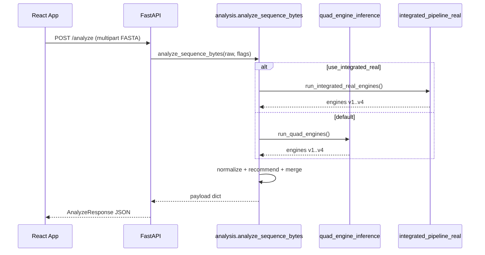
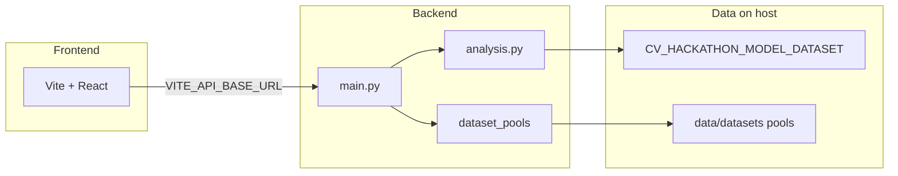

<div align="center">

# GeneZap Clinical Console

**Quad-engine bacterial genome analysis with optional hackathon artifact pipeline, dataset pools, and deployment-ready FastAPI + React.**

[](https://www.python.org/)
[](https://fastapi.tiangolo.com/)
[](https://react.dev/)
[](https://vitejs.dev/)
[](https://www.tensorflow.org/)

[Features](#-key-features) · [Architecture](#-system-architecture) · [Quick start](#-installation--local-setup) · [Dataset pools](#-dataset-pool-system) · [API](#-api-reference) · [Deploy](#-deployment) · [Roadmap](#-future-roadmap)

</div>

---

## What this is

**GeneZap** is a **research and hackathon-grade** workspace for **antimicrobial resistance (AMR)** exploration from **bacterial DNA (FASTA)**. Upload an assembly (or manage a **pool** of genomes), run **four complementary inference channels** (V1–V4), and review a structured JSON report in a **React clinical console**.

**Problem space:** AMR is multi-modal—taxonomy, drug panels, sequence-derived imagery, and curated resistance genes all carry signal. This repo **orchestrates** those signals instead of collapsing them into a single black box.

**What makes the architecture distinctive:**

| Aspect | Approach |
|--------|----------|
| **Dual inference backends** | Default **quad-engine** (`run_quad_engines`) with resilient fallbacks; optional **integrated hackathon** path that loads **frozen joblib/Keras artifacts** from `CV_HACKATHON_MODEL_DATASET`. |
| **Single orchestration API** | `analyze_sequence_bytes()` in `backend/analysis.py` normalizes outputs and builds stewardship-style recommendations—same contract for direct upload and pool-backed analyze. |
| **Dataset pools** | Filesystem-backed pools + JSON manifests + async **batch jobs** (see `backend/dataset_pools/`), designed to migrate later to **object storage + Postgres** without rewriting the UI contract. |
| **Deployment split** | **Vite static frontend** (Vercel-friendly) + **containerized FastAPI** (Dockerfile at repo root) with env-driven CORS, upload limits, and readiness probes. |

> **Disclaimer:** This is a **demonstration / research** stack—not a regulated medical device. Outputs require laboratory confirmation and clinical judgment.

---

## Screenshots & demo

> Add your own captures under `docs/images/` and link them here for portfolio polish.

| Placeholder | Suggested capture |
|-------------|-------------------|
| **Clinical console** | Full-width `App.jsx` intake + report after a successful scan. |
| **Dataset pool** | “Dataset pool” tab: pool selector, file table, multi-upload. |
| **Batch analysis** | Batch job status + “Open result” chips after completion. |
| **Engine tabs** | V1 & V3 / V2 pharmacology / V4 CARD tabs showing `diagnostic_report.engines`. |

```markdown
<!-- Example once you have assets:

-->
```

---

## Key features

- **Quad-engine AMR inference** — V1 profiler, V2 pharmacology, V3 CGR/vision channel, V4 CARD-aligned discovery (`backend/quad_engine_inference.py`).
- **Integrated hackathon engine** — Same V1→V4 story using **artifact pickles + Keras** from `CV_HACKATHON_MODEL_DATASET` (`backend/integrated_pipeline_real.py`); configurable via **`GENEZAP_CV_ARTIFACT_ROOT`**.
- **FASTA upload & analysis** — `POST /analyze` with optional `pitch_demo` (demo JSON) and `use_integrated_real` (**mutually exclusive** with pitch in `analysis.py`).
- **Dataset pool management** — Create pools, multi-file upload, optional guarded **server path import** (dev only), manifest **snapshots** (`backend/dataset_pools/`).
- **Batch analysis** — `POST /datasets/pools/{id}/batch-jobs` + polling; results written under `GENEZAP_DATASETS_ROOT/jobs/`.
- **Multi-engine orchestration** — `normalize_engines_for_ui` + `build_final_recommendation` in `backend/analysis.py`.
- **TensorFlow + scikit-learn** — Keras `.h5` (V3 integrated path), `joblib` models (V1/V2), optional TF skip for smoke tests (`GENEZAP_SKIP_TENSORFLOW`).
- **CARD-based resistance detection** — Local FASTA alignment path in quad + integrated V4 branches.
- **React + FastAPI** — Vite 8, React 19, Tailwind v4, Framer Motion; FastAPI + Pydantic response models (`backend/main.py`).
- **Deployment-ready** — Root `Dockerfile`, `.dockerignore`, `docs/DEPLOYMENT.md`, `backend/env.example`, `frontend/vercel.json`, `frontend/src/config.js` (`VITE_API_BASE_URL`).
- **Operational hooks** — `/health`, `/health/live`, `/ready`, `client_warnings` in API responses for UI notices.
- **Roadmap-friendly settings** — Central `backend/genezap_settings.py` for limits, CORS, and environment profile.

---

## System architecture

### High-level flow

```text
Frontend (Vite/React)  →  HTTPS API (FastAPI)
                              ↓
                    analyze_sequence_bytes()
                              ↓
              ┌───────────────┴────────────────┐
              │ use_integrated_real?         │
         yes  │                                │ no
              ↓                                ↓
   run_integrated_real_engines()      run_quad_engines()
   (CV artifact tree + TF/Keras)    (multi-root discovery + mocks on failure)
              └───────────────┬────────────────┘
                              ↓
                 normalize_engines_for_ui()
                              ↓
                build_final_recommendation()
                              ↓
           merge_v2_pharmacology_into_payload()
                              ↓
                     JSON → UI / pool batch files
```

**Dataset pool side path:** Browser → `POST /datasets/pools/...` (CRUD, upload) → stored FASTA on disk → `POST .../analyze` or batch job → **`analyze_sequence_bytes(bytes)`** (same core as `/analyze`).

### Mermaid — request lifecycle (single upload)



### Mermaid — repository layout (logical)



### Engine modes (summary)

| Mode | Trigger | Implementation |
|------|---------|----------------|
| **Quad-engine** | Default (`use_integrated_real=false`) | `run_quad_engines()` — searches multiple artifact roots, **falls back to mock engines** if artifacts or TF fail (never raises from the runner). |
| **Integrated** | `use_integrated_real=true` | Lazy-imported `run_integrated_real_engines()` — expects **known paths** under `GENEZAP_CV_ARTIFACT_ROOT` or repo `CV_HACKATHON_MODEL_DATASET/`; on failure **`analysis.py` falls back to quad** and surfaces **`client_warnings`**. |
| **Pitch demo** | `pitch_demo=true` **and** integrated **off** | `apply_pitch_demo_profile()` replaces engine JSON with a **fixed Salmonella MDR narrative** while keeping real assembly metrics from the upload. |

---

## Tech stack

| Layer | Technologies |
|--------|----------------|
| **Frontend** | React 19, Vite 8, Tailwind CSS v4 (`@tailwindcss/vite`), Framer Motion, Lucide icons |
| **Backend** | Python 3.11+, FastAPI, Uvicorn, Pydantic v2, Starlette middleware |
| **ML / numerics** | TensorFlow/Keras (V3 paths), scikit-learn artifacts via `joblib`, NumPy, Pandas, Matplotlib, Pillow |
| **Reference data** | CARD-derived FASTA and gene-detection helpers under `CV_HACKATHON_MODEL_DATASET` / `backend/V4_GENE_DETECTION` |
| **Storage (current)** | Filesystem: `data/datasets/` for pools + jobs (`GENEZAP_DATASETS_ROOT`); model bundle path (`GENEZAP_CV_ARTIFACT_ROOT`) |
| **Deployment** | Docker (repo root), optional Render/Fly; static frontend on Vercel (see `docs/DEPLOYMENT.md`) |
| **Planned** | S3/R2 blobs, PostgreSQL metadata, Redis + Celery workers, dedicated inference service |

---

## Folder structure

> Trimmed to the **contract surfaces** collaborators touch most often. Training notebooks and large corpora may live under `CV_HACKATHON_MODEL_DATASET/` (partially gitignored—see `.gitignore`).

```text
BV-BRC_Dataset/
├── Dockerfile                 # API image: backend + CV_HACKATHON_MODEL_DATASET + uvicorn
├── .dockerignore
├── README.md                  # You are here
├── docs/
│   ├── DEPLOYMENT.md          # Vercel + Render/Fly + env matrix
│   └── DATASET_POOLS.md     # Pool API, manifests, import semantics
├── data/datasets/             # Default GENEZAP_DATASETS_ROOT (pools + jobs; gitignored contents)
├── frontend/
│   ├── src/
│   │   ├── App.jsx            # Main clinical UI (single FASTA + dataset pool tab)
│   │   ├── config.js          # VITE_API_BASE_URL → API_BASE
│   │   ├── services/datasetsApi.js
│   │   ├── components/dataset/DatasetPoolPanel.jsx
│   │   └── utils/apiError.js
│   ├── vercel.json            # SPA rewrites for Vercel
│   ├── vite.config.js
│   └── package.json
├── backend/
│   ├── main.py                # FastAPI app, CORS, /analyze, health/ready
│   ├── analysis.py            # Orchestration: parse FASTA → engines → payload
│   ├── quad_engine_inference.py
│   ├── integrated_pipeline_real.py
│   ├── genezap_settings.py    # Central deployment env
│   ├── dataset_pools/         # Pools router, repository, batch jobs, validation
│   ├── middleware/max_body.py
│   ├── env.example
│   └── requirements.txt
└── CV_HACKATHON_MODEL_DATASET/
    ├── V1_Model_Output/       # Integrated V1 pickles (when committed / present)
    ├── V2_Model_Output/
    ├── V3_Model_Output/
    ├── V4_GENE_DETECTION/
    ├── MAIN_MODEL/CARD_DB.fasta
    └── INTEGRATED_AMR_PIPELINE_REAL.py   # CLI reference (API uses integrated_pipeline_real.py)
```

---

## Installation & local setup

### Prerequisites

- **Python 3.11+** (recommended for TensorFlow wheels)
- **Node.js 20+** (for Vite 8)
- **Git LFS or local copies** of large model files where `.gitignore` excludes them (see repo `.gitignore` for `*.pkl` / `*.h5` rules)

### Backend

```bash
cd backend
python -m venv .venv
# Windows: .venv\Scripts\activate
# macOS/Linux: source .venv/bin/activate
pip install -r requirements.txt
uvicorn main:app --reload --port 8000
```

- **API:** `http://127.0.0.1:8000`
- **Liveness:** `GET /health` or `GET /health/live`
- **Readiness (writable data dir):** `GET /ready`

Copy `backend/env.example` to `.env` and load with your tooling if desired (variables are also read from the process environment).

### Frontend

```bash
cd frontend
npm install
# Optional: echo VITE_API_BASE_URL=http://127.0.0.1:8000 > .env.local
npm run dev
```

- **Dev server:** default Vite port **5173**
- **Production build:** `npm run build` → `frontend/dist/`

### Docker (full API + CV bundle)

From **repository root**:

```bash
docker build -t genezap-api .
docker run --rm -p 8000:8000 -e GENEZAP_CORS_ORIGINS=http://localhost:5173 genezap-api
```

Mount a volume for persistent pools:

```bash
docker run --rm -p 8000:8000 -v genezap-data:/data/datasets -e GENEZAP_DATASETS_ROOT=/data/datasets genezap-api
```

### Troubleshooting

| Symptom | Check |
|---------|--------|
| Integrated mode errors | `GENEZAP_CV_ARTIFACT_ROOT` or sibling `CV_HACKATHON_MODEL_DATASET/`; `client_warnings` in JSON; server logs. |
| TF DLL / import errors | `GENEZAP_SKIP_TENSORFLOW=1` (quad path degrades V3; integrated mode will error or fallback with warning). |
| CORS in browser | `GENEZAP_CORS_ORIGINS` includes your Vite/Vercel origin; HTTPS↔HTTP mixed content. |
| Pitch “overwrites” integrated | **Mutually exclusive** in UI and API—disable pitch demo when using integrated. |

---

## Dataset pool system

- **Storage:** Each pool is a UUID directory under `pools/<pool_id>/` with `pool_manifest.json` and `files/` (`backend/dataset_pools/repository.py`). Jobs live under `jobs/<job_id>/`.
- **Import:** Multi-part **`files`** field on `POST /datasets/pools/{id}/files`, or **server path import** when `GENEZAP_ALLOW_DATASET_PATH_IMPORT=1` and **not** `GENEZAP_ENV=production` (`import-path` route).
- **Batch:** `POST .../batch-jobs` schedules `BackgroundTasks` to run `analyze_sequence_bytes` per file; poll `GET /datasets/batch-jobs/{job_id}`; fetch `GET .../results/{file_id}`.
- **Snapshots:** `POST .../snapshot` bumps `manifest_version` and writes `snapshots/vN.json`.
- **Validation:** Extension checks, size caps, basic FASTA sniffing (`dataset_pools/validation.py`); limits from `genezap_settings.py`.

**Why filesystem first:** zero extra services for hackathon/research demos; **upgrade path** is env-indirection today (`GENEZAP_DATASETS_ROOT`) → object storage + DB tomorrow. See `docs/DATASET_POOLS.md`.

---

## Inference engines

| Engine | Role (quad path) | Integrated path notes |
|--------|------------------|------------------------|
| **V1** | Species / profiler-style payload from k-mers + artifacts when present | Loads `bacterial_id_model.pkl` + label encoder from CV tree |
| **V2** | Pharmacology / drug panel from artifacts or heuristics + mocks | Multi-drug loop over `v2_feature_columns_FIXED.pkl` + multiclass model |
| **V3** | CGR + CNN or fallback imagery | Keras `v3_vision_model.h5` + CGR PNG round-trip |
| **V4** | CARD / discovery hits | `V4_GENE_DET` + `CARD_DB.fasta` when available |

**Orchestration:** `analysis.py` chooses integrated vs quad, normalizes UI contract, builds `final_recommendation`, optionally attaches `susceptibility_profile`, merges **`v2_pharmacology_table`** metadata for the dashboard.

**Fallback logic:** Quad runner catches per-engine failures and substitutes mocks so the API rarely hard-fails; integrated path **raises** on missing artifacts/TF and is **caught** in `analyze_sequence_bytes` to **fall back to quad** with explicit warnings.

---

## Deployment

Full matrix: **`docs/DEPLOYMENT.md`**.

| Target | Notes |
|--------|--------|
| **Frontend (Vercel)** | Project root `frontend/`; set **`VITE_API_BASE_URL`** to your HTTPS API; `vercel.json` SPA rewrite included. |
| **Backend (Render / Fly.io)** | Build from root `Dockerfile`; set `GENEZAP_ENV`, `GENEZAP_CORS_ORIGINS`, `GENEZAP_DATASETS_ROOT`, optional `GENEZAP_CV_ARTIFACT_ROOT`. |
| **Free tier** | Expect **cold starts**, **RAM pressure** with TensorFlow, **ephemeral disks** without volumes, **HTTP timeouts** on very large assemblies or long batches. |

---

## Current limitations

- **Not a medical device** — demo, research, and portfolio use only.
- **Quad-engine mocks** — Missing artifacts yield **simulated** engine JSON; operators must read `mode` fields in payloads.
- **Batch jobs** — `BackgroundTasks` are **single-process**; not durable across replicas without a queue.
- **Pitch vs integrated** — Pitch demo **replaces** engine JSON; the product enforces **mutual exclusion** to avoid silent overwrites.
- **Large genomes** — Memory and wall-clock scale with sequence length and V2 panel size.

---

## Future roadmap

- **PostgreSQL** — Pool metadata, ACLs, audit trails, job state.
- **S3 / Cloudflare R2** — FASTA blobs + batch result objects; presigned uploads from the browser.
- **Redis + Celery** (or managed queue) — Durable batch and rate limiting.
- **Inference workers** — Separate TF-serving or Triton for GPU and autoscaling API.
- **Plugin / registry pattern** — Versioned engine registration instead of hard-coded `v1`–`v4` keys only.
- **MLOps** — Model registry, canary deploys, structured tracing (OpenTelemetry).

---

## API reference

Base URL: your deployed API, e.g. `https://api.example.com`.

### Core analysis

`POST /analyze` — multipart form field **`file`** (`.fna`, `.fasta`, `.fa`).

| Query param | Default | Description |
|-------------|---------|-------------|
| `pitch_demo` | `false` | Salmonella MDR **demo** engine JSON (only if integrated is **off**). |
| `use_integrated_real` | `false` | Use **CV hackathon artifact** pipeline; incompatible with `pitch_demo`. |

**Example:**

```bash
curl -sS -X POST "http://127.0.0.1:8000/analyze?use_integrated_real=true" \
  -F "file=@sample.fna"
```

**Response highlights:** `diagnostic_report.engines` (v1–v4), `final_recommendation`, optional `susceptibility_profile`, optional `diagnostic_report.client_warnings` (e.g. integrated fallback or pitch suppression notice).

### Health

| Route | Purpose |
|-------|---------|
| `GET /health` | Simple OK |
| `GET /health/live` | Process up |
| `GET /ready` | Writable `GENEZAP_DATASETS_ROOT` (503 if not) |

### Dataset pools (`/datasets`)

See **`docs/DATASET_POOLS.md`** for the full table. Short list:

- `POST /datasets/pools` — create pool  
- `GET /datasets/pools` — list  
- `GET /datasets/pools/{pool_id}` — detail + files  
- `POST /datasets/pools/{pool_id}/files` — multipart **`files`** (repeat field per FASTA)  
- `POST /datasets/pools/{pool_id}/files/{file_id}/analyze` — same inference core as `/analyze`  
- `POST /datasets/pools/{pool_id}/batch-jobs` — async batch (`file_ids` in JSON body)  
- `GET /datasets/batch-jobs/{job_id}` — status  
- `GET /datasets/batch-jobs/{job_id}/results/{file_id}` — one result JSON  
- `GET /datasets/config/hints` — operator-facing limits (non-secret)

<details>
<summary>Example: create pool + upload</summary>

```bash
POOL=$(curl -sS -X POST http://127.0.0.1:8000/datasets/pools \
  -H "Content-Type: application/json" \
  -d '{"name":"lab-batch-01","description":"BV-BRC subset"}' | jq -r .pool_id)

curl -sS -X POST "http://127.0.0.1:8000/datasets/pools/$POOL/files" \
  -F "files=@genome1.fna" -F "files=@genome2.fna"
```

</details>

---

## Contributing

1. **Scope** — Open an issue or short design note before large refactors; prefer incremental PRs.
2. **Inference** — Do not remove mock fallbacks in `run_quad_engines` without a migration plan for demos; integrated path changes must keep **`analyze_sequence_bytes`** contract stable.
3. **Frontend** — Match existing Tailwind / motion patterns in `App.jsx`; centralize API calls via `src/config.js` and `services/datasetsApi.js`.
4. **Datasets / models** — Never commit secrets or patient-identifiable data; respect `.gitignore` for large binaries.
5. **Style** — Run `npm run lint` in `frontend/`; format Python consistently with the surrounding module.

---

## License & credits

- **License:** Add a root `LICENSE` file (e.g. MIT, Apache-2.0, or research-only terms) and reference it here.
- **Third-party:** CARD (McMaster University) and BV-BRC / NCBI-style data sources should be cited in publications or derivative work per their respective licenses.
- **Authors:** Replace this line with maintainer names, lab affiliation, or hackathon team credit.

---

## Appendix — key environment variables

| Variable | Role |
|----------|------|
| `GENEZAP_ENV` | `production` / `prod` / `staging` — tightens defaults (e.g. disables path import). |
| `GENEZAP_CORS_ORIGINS` | Comma-separated browser origins for CORS. |
| `GENEZAP_DATASETS_ROOT` | Writable root for pools + batch jobs. |
| `GENEZAP_CV_ARTIFACT_ROOT` | Root of `CV_HACKATHON_MODEL_DATASET`-style tree for integrated mode. |
| `GENEZAP_MAX_UPLOAD_MB` | Request body / analyze size budget. |
| `GENEZAP_MAX_BATCH_FILES` | Max files per batch job. |
| `GENEZAP_SKIP_TENSORFLOW` | Skip TF import paths where supported (integrated V3 requires TF). |
| `VITE_API_BASE_URL` | **Frontend build-time** API origin (Vercel / CI). |

Full template: **`backend/env.example`**.
